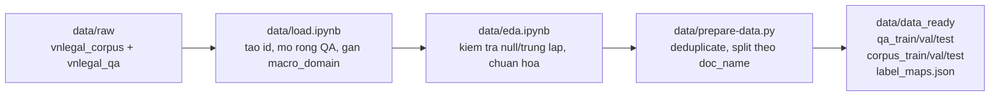
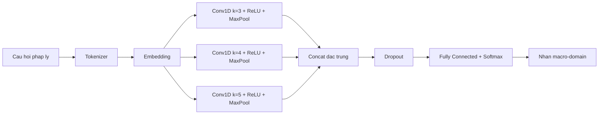
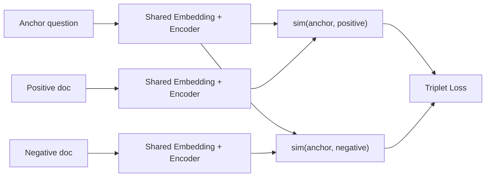
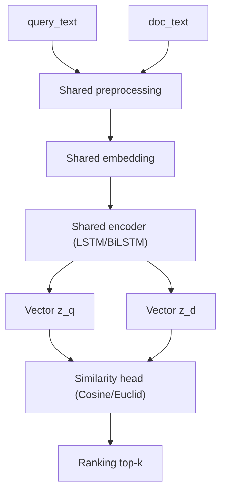
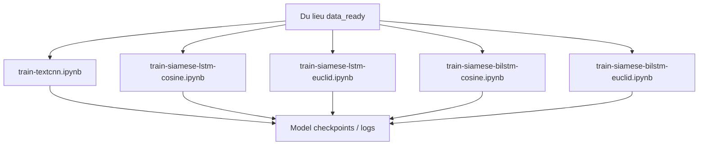

# HỌC VIỆN CÔNG NGHỆ BƯU CHÍNH VIỄN THÔNG
## KHOA CÔNG NGHỆ THÔNG TIN 2

----------o0o----------

# BÁO CÁO
**Môn Học:** NHẬP MÔN HỌC SÂU  
**Đề tài:**  
**Hệ thống hỏi đáp pháp luật tiếng Việt dựa trên RAG (VNLegal RAG)**  

**Giảng viên hướng dẫn:**  
Nguyễn Ngọc Duy  

**Sinh viên thực hiện:**  
Trần Phi Hùng - N22DCAT007  
Phạm Nguyễn Quốc Huy - N22DCCN004  
Vũ Hoàng Phát - N22DCCN184  

**Lớp:**  
E22CQCNTT01-N  

**Khóa:**  
2022-2027  

**Hệ:**  
Đại học_CLC  

---

**Hồ Chí Minh, ngày 26 tháng 04 năm 2026**

---

# MỤC LỤC

- CHƯƠNG 1: GIỚI THIỆU CHUNG  
- CHƯƠNG 2: DỮ LIỆU VÀ TIỀN XỬ LÝ  
- CHƯƠNG 3: MÔ HÌNH VÀ PHƯƠNG PHÁP  
- CHƯƠNG 4: QUY TRÌNH HUẤN LUYỆN VÀ THỰC NGHIỆM  
- CHƯƠNG 5: KIẾN TRÚC TRIỂN KHAI HỆ THỐNG  
- CHƯƠNG 6: TỔNG KẾT VÀ HƯỚNG PHÁT TRIỂN  

---

# CHƯƠNG 1: GIỚI THIỆU CHUNG

## 1.1 Giới thiệu đề tài
Đề tài tập trung xây dựng hệ thống hỏi đáp pháp luật tiếng Việt theo hướng Retrieval-Augmented Generation (RAG), giúp truy xuất tri thức pháp lý đúng ngữ cảnh và hạn chế trả lời suy diễn. Hệ thống khai thác tập dữ liệu hỏi đáp pháp luật, kết hợp mô hình phân loại miền pháp lý và các mô hình học sâu để nâng chất lượng truy vấn.

Về bản chất, hệ thống giải quyết đồng thời hai bài toán:
- **Bài toán định tuyến truy vấn (Query Routing):** xác định câu hỏi thuộc nhóm nội dung pháp lý nào để thu hẹp không gian tìm kiếm.
- **Bài toán so khớp ngữ nghĩa (Semantic Matching):** tìm các cặp câu hỏi - tài liệu có mức tương đồng cao thay vì so khớp từ khóa đơn thuần.

Điểm mạnh của hướng RAG trong ngữ cảnh pháp lý là cho phép tách rời:
1. **Kho tri thức pháp lý** (dữ liệu luật, câu hỏi, văn bản liên quan).
2. **Thành phần truy xuất** (retrieval/ranking).
3. **Thành phần phản hồi cuối** (generation hoặc chọn đáp án).

Nhờ đó, hệ thống dễ cập nhật tri thức khi có thay đổi văn bản pháp luật mà không cần huấn luyện lại toàn bộ mô hình từ đầu.

## 1.2 Mục tiêu của hệ thống
- Chuẩn hóa dữ liệu pháp luật thành tập huấn luyện có cấu trúc.
- Phân loại câu hỏi theo macro-domain nhằm định hướng truy xuất.
- Hỗ trợ pipeline truy vấn pháp lý nhanh, chính xác và dễ mở rộng.
- Tạo nền tảng để tích hợp chatbot pháp lý tiếng Việt trong các ứng dụng thực tế.

Mục tiêu được lượng hóa theo từng lớp kỹ thuật:
- **Lớp dữ liệu:** giảm dữ liệu nhiễu (null, trùng lặp, lệch định dạng), đảm bảo tập train/val/test tách biệt theo nhóm tài liệu.
- **Lớp mô hình:** cải thiện khả năng nhận diện miền pháp lý và tăng độ đúng của tài liệu truy xuất top-k.
- **Lớp hệ thống:** duy trì pipeline có thể tái chạy (reproducible), dễ thay mô hình và dễ mở rộng sang các tác vụ pháp lý khác.

## 1.3 Công cụ và môi trường phát triển
- Ngôn ngữ chính: Python.
- Môi trường lập trình: Jupyter Notebook và Visual Studio Code/Cursor.
- Quản lý dữ liệu: CSV, Hugging Face Datasets.
- Framework học sâu: PyTorch.

Lý do lựa chọn:
- **Notebook** phù hợp cho nghiên cứu, dễ quan sát quá trình tiền xử lý và kết quả trung gian.
- **Python + PyTorch** linh hoạt khi thử nghiệm nhiều kiến trúc (TextCNN, LSTM, BiLSTM) trên cùng tập dữ liệu.
- **Hugging Face Datasets/Arrow** hỗ trợ lưu trữ hiệu quả, đọc nhanh và tái sử dụng ở nhiều phiên chạy.

## 1.4 Các thư viện và framework sử dụng
### 1.4.1 `torch` (PyTorch)
Thư viện lõi để huấn luyện mô hình học sâu, tối ưu trọng số và chạy suy luận.

### 1.4.2 `transformers`
Hiện chưa sử dụng trong phạm vi phiên bản dự án đang báo cáo.

### 1.4.3 `datasets`
Đọc và quản lý dữ liệu dạng Arrow, hỗ trợ lưu/khôi phục tập dữ liệu chuẩn hóa.

### 1.4.4 `scikit-learn`
Sử dụng cho chia tập dữ liệu có ràng buộc nhóm (`StratifiedGroupKFold`) và đánh giá phân lớp.

### 1.4.5 `pandas`, `numpy`
Xử lý bảng dữ liệu, làm sạch, tổng hợp và tính toán thống kê.

### 1.4.6 `json`, `os`, `pathlib`
Nhóm thư viện chuẩn của Python để đọc/ghi metadata, tổ chức đường dẫn dữ liệu và quản lý cấu trúc thư mục thí nghiệm.

---

# CHƯƠNG 2: DỮ LIỆU VÀ TIỀN XỬ LÝ

## 2.1 Nguồn dữ liệu
Hệ thống sử dụng dữ liệu pháp lý tiếng Việt trong thư mục `data/raw/`, gồm:
- `vnlegal_corpus`: tập văn bản/corpus pháp lý.
- `vnlegal_qa`: tập câu hỏi - trả lời tương ứng.

Đặc trưng dữ liệu pháp lý:
- Văn bản dài, nhiều điều khoản, nhiều tham chiếu chéo.
- Câu hỏi người dùng đa dạng cách diễn đạt nhưng cùng ý nghĩa pháp lý.
- Dễ xuất hiện mất cân bằng miền (một số lĩnh vực có nhiều mẫu hơn các lĩnh vực khác).

## 2.2 Quy trình xử lý dữ liệu
Pipeline dữ liệu hiện tại gồm 3 bước chính:



### 2.2.1 `data/load.ipynb`
- Tạo `passage_id`, `qa_id`.
- Mở rộng dữ liệu điều luật thành các dòng QA.
- Gán nhãn `macro_domain` theo quy tắc dựa trên `doc_name`.

### 2.2.2 `data/eda.ipynb`
- Kiểm tra null và trùng lặp.
- Chuẩn hóa `question_type`, `difficulty`.
- Phân tích phân phối nhãn và độ dài văn bản.
- Lưu dữ liệu sạch vào `data/processed/`.

Trong bước EDA, các tiêu chí kiểm tra quan trọng gồm:
- **Tính đầy đủ:** tỷ lệ dữ liệu trống ở các cột bắt buộc.
- **Tính duy nhất:** tỷ lệ bản ghi trùng câu hỏi hoặc trùng cặp hỏi-đáp.
- **Tính cân bằng:** phân phối số lượng mẫu theo `macro_domain`.
- **Đặc điểm độ dài:** độ dài câu hỏi/tài liệu để chọn ngưỡng cắt (max length) phù hợp cho mô hình.

### 2.2.3 `data/prepare-data.py`
- Deduplicate dữ liệu corpus và QA.
- Join thêm `doc_name`.
- Chia train/val/test theo nhóm `doc_name` để tránh rò rỉ dữ liệu.
- Xuất dữ liệu cuối cùng sang `data/data_ready/`:
  - `qa_train.csv`, `qa_val.csv`, `qa_test.csv`
  - `corpus_train.csv`, `corpus_val.csv`, `corpus_test.csv`
  - `label_maps.json`

Việc chia theo nhóm `doc_name` có ý nghĩa thực nghiệm quan trọng:
- Nếu cùng một văn bản xuất hiện cả train và test, mô hình có thể học thuộc mẫu diễn đạt thay vì học quy luật ngữ nghĩa.
- Group split giúp đánh giá sát hơn khả năng tổng quát hóa trên văn bản pháp lý chưa gặp.

## 2.3 Đặc điểm dữ liệu mục tiêu
- Dữ liệu đầu vào mô hình phân loại: câu hỏi pháp lý tiếng Việt.
- Nhãn mục tiêu: `macro_domain`.
- Dữ liệu kiểm thử độc lập được giữ tách biệt để đánh giá cuối cùng.

Ngoài nhãn phân loại, dữ liệu còn phục vụ truy xuất qua:
- Chuỗi câu hỏi chuẩn hóa.
- Thông tin tài liệu gốc (`doc_name`, chỉ mục đoạn).
- Các trường metadata hỗ trợ phân tích lỗi sau huấn luyện.

---

# CHƯƠNG 3: MÔ HÌNH VÀ PHƯƠNG PHÁP

## 3.1 Bộ phân loại miền pháp lý (Macro-domain Classifier)
Trong phạm vi repo hiện tại, bài toán phân loại miền được thực nghiệm bằng nhánh `TextCNN` trong notebook:
- `model/train-textcnn.ipynb`

Kiến trúc chính:
- **Đầu phân lớp TextCNN (Kim, 2014)**:
  - Kích thước kernel: 3, 4, 5.
  - 100 feature maps cho mỗi kernel.
  - ReLU + Max-over-time pooling.
  - Dropout = 0.5.
  - Ràng buộc max-norm lớp ra = 3.0.



## 3.2 Chiến lược huấn luyện
- Huấn luyện theo quy trình notebook với dữ liệu đã chuẩn hóa trong `data/data_ready/`.
- Theo dõi chỉ số huấn luyện/đánh giá qua lịch sử train trong notebook.
- Điều chỉnh siêu tham số theo từng lần chạy thực nghiệm.

Quy trình huấn luyện khuyến nghị:
1. Chốt phiên bản dữ liệu đầu vào (snapshot file trong `data/data_ready/`).
2. Cố định seed cho các thư viện ngẫu nhiên để dễ so sánh thí nghiệm.
3. Huấn luyện baseline TextCNN trước, ghi nhận metric chuẩn.
4. Huấn luyện nhánh Siamese để so sánh khả năng so khớp ngữ nghĩa.
5. Đối chiếu định lượng và định tính trên cùng tập kiểm thử.

Các chỉ số nên theo dõi:
- **Phân loại:** Accuracy, Macro-F1, Confusion Matrix theo `macro_domain`.
- **Truy xuất:** Recall@k, MRR (nếu có ranking top-k).
- **Vận hành:** thời gian suy luận trung bình mỗi truy vấn.

## 3.3 Nhánh mô hình Siamese trong thư mục `model/`
Repo hiện có các notebook huấn luyện Siamese:
- `train-siamese-lstm-cosine.ipynb`
- `train-siamese-lstm-euclid.ipynb`
- `train-siamese-bilstm-cosine.ipynb`
- `train-siamese-bilstm-euclid.ipynb`

Các mô hình này phục vụ học biểu diễn câu hỏi - tài liệu theo độ tương đồng, hỗ trợ so khớp ngữ nghĩa cho bài toán truy xuất.
Trong thực nghiệm, 4 notebook trên được dùng để **so sánh kiến trúc và hàm đo tương đồng** (LSTM/BiLSTM, Cosine/Euclid) trên cùng bộ dữ liệu và cùng tiêu chí đánh giá.
Sau giai đoạn so sánh, hệ thống **chỉ chọn 1 cấu hình Siamese tốt nhất** để đưa vào pipeline suy luận; không triển khai đồng thời cả 4 mô hình trong production pipeline.



## 3.4 Mô hình embedding dùng chung
File `model/shared_embedding.py` quản lý embedding dùng chung và artifacts tại `model/shared_embedding_artifacts/`, giúp tái sử dụng tokenizer/vector giữa các thí nghiệm.

Lợi ích kỹ thuật của embedding dùng chung:
- Giảm chênh lệch biểu diễn giữa các mô hình trong cùng pipeline.
- Tăng tính nhất quán khi so sánh nhiều kiến trúc trên cùng một không gian vector.
- Giảm thời gian chuẩn bị dữ liệu cho các lần huấn luyện tiếp theo.

## 3.5 Mô tả cấu trúc và thuật toán cốt lõi
### 3.5.1 Cấu trúc nhánh TextCNN (phân loại miền)
Đầu vào là chuỗi câu hỏi pháp lý đã tokenize và padding về cùng chiều dài.
Mỗi câu hỏi được ánh xạ thành ma trận embedding kích thước `L x d` (với `L` là độ dài chuỗi, `d` là chiều embedding).

Khối tích chập nhiều kernel hoạt động song song:
- Kernel `k=3`, `k=4`, `k=5` để bắt các n-gram pháp lý có độ dài khác nhau.
- Mỗi kernel sinh 100 feature maps.
- ReLU để tạo phi tuyến và Max-over-time pooling để giữ đặc trưng mạnh nhất trên mỗi map.

Đặc trưng từ các nhánh được nối (concat), qua dropout, sau đó đi vào fully connected + softmax để dự đoán `macro_domain`.

### 3.5.2 Cấu trúc đầy đủ của nhánh Siamese (so khớp ngữ nghĩa)
Để tránh mơ hồ, toàn bộ Siamese trong dự án có thể mô tả theo chuỗi khối sau:

1. **Input layer**
- `query_text`: câu hỏi pháp lý người dùng.
- `doc_text`: đoạn văn bản pháp luật ứng viên.
- Trong huấn luyện triplet còn có `negative_doc_text`.

2. **Shared preprocessing**
- Chuẩn hóa văn bản (lowercase/clean ký tự theo cùng quy tắc).
- Tokenize bằng cùng tokenizer.
- Padding/truncation về cùng `max_len`.

3. **Shared embedding layer**
- Cả hai nhánh dùng chung ma trận embedding (trọng số dùng chung).
- Mục tiêu: bảo đảm query và document được ánh xạ vào cùng không gian biểu diễn.

4. **Shared sequence encoder**
- Một trong hai encoder được thử nghiệm:
  - **LSTM** (1 chiều thời gian).
  - **BiLSTM** (hai chiều forward/backward).
- Encoder cũng dùng chung trọng số cho cả nhánh query và nhánh document.

5. **Sentence vector pooling/projection**
- Từ hidden states của encoder, lấy vector câu đại diện (ví dụ last hidden/mean pooling theo cấu hình notebook).
- Có thể chuẩn hóa vector trước khi tính độ tương đồng (đặc biệt trong cấu hình cosine).

6. **Similarity head**
- **Cosine branch**: tính `sim(q, d) = cosine(z_q, z_d)`.
- **Euclid branch**: tính `dist(q, d) = ||z_q - z_d||_2` (hoặc score âm của khoảng cách để ranking).

7. **Loss & optimization (training only)**
- Với triplet `(q, d+, d-)`, tối ưu sao cho:
  - `sim(q, d+) > sim(q, d-)` (đối với cosine), hoặc
  - `dist(q, d+) < dist(q, d-)` (đối với euclid).
- Hàm mất mát dùng margin-based objective (triplet-style) để tách cặp đúng/sai.

8. **Inference & ranking**
- Input query mới -> mã hóa thành `z_q`.
- Mỗi ứng viên tài liệu -> mã hóa thành `z_d`.
- Tính score tương đồng, sắp xếp giảm dần độ phù hợp, trả top-k.

Tóm lại, khác biệt giữa 4 notebook chỉ nằm ở:
- **Encoder**: LSTM vs BiLSTM.
- **Hàm đo**: Cosine vs Euclid.
Các thành phần còn lại (tokenizer, embedding dùng chung, quy trình ranking) giữ nhất quán để so sánh công bằng.



### 3.5.3 Thuật toán chọn mô hình tốt nhất
Chiến lược chọn mô hình được thực hiện theo 2 bước:
1. **Benchmark 4 cấu hình**: LSTM-Cosine, LSTM-Euclid, BiLSTM-Cosine, BiLSTM-Euclid trên cùng data split.
2. **Ra quyết định 1 mô hình**: chọn mô hình có chất lượng retrieval tốt nhất (ưu tiên Recall@k, MRR), đồng thời giữ thời gian suy luận phù hợp.

Mô hình được chọn sẽ là mô hình duy nhất đi vào pipeline suy luận cuối.

---

# CHƯƠNG 4: QUY TRÌNH HUẤN LUYỆN VÀ THỰC NGHIỆM

## 4.1 Cài đặt môi trường
```bash
python -m pip install -r requirements.txt
```

Khuyến nghị thực nghiệm:
- Sử dụng virtual environment riêng cho dự án.
- Ghi lại phiên bản Python và phiên bản thư viện chính để tái lập kết quả.
- Nếu huấn luyện trên GPU, kiểm tra tương thích CUDA trước khi chạy notebook dài.

## 4.2 Tiền xử lý dữ liệu
Thực hiện theo thứ tự:
1. `data/load.ipynb`
2. `data/eda.ipynb`
3. `data/prepare-data.py`

Kết quả tạo ra bộ dữ liệu chuẩn tại `data/data_ready/`.

## 4.3 Huấn luyện mô hình
Các notebook huấn luyện chính:
- `model/train-textcnn.ipynb`
- `model/train-siamese-lstm-cosine.ipynb`
- `model/train-siamese-lstm-euclid.ipynb`
- `model/train-siamese-bilstm-cosine.ipynb`
- `model/train-siamese-bilstm-euclid.ipynb`

Lưu ý thực nghiệm:
- Bốn notebook Siamese được chạy để benchmark và chọn cấu hình tốt nhất.
- Chỉ checkpoint của mô hình Siamese tốt nhất được dùng khi build pipeline cuối.

### 4.3.0 Tham số huấn luyện
Các thí nghiệm Siamese được thiết kế theo hướng giữ cố định phần lớn tham số để so sánh công bằng giữa LSTM và BiLSTM.

Tham số dùng chung:
- `MAX_VOCAB = 30000`
- `MAX_Q_LEN = 64`
- `MAX_D_LEN = 256`
- `EPOCHS = 20`
- `MIN_DELTA = 1e-4`
- `embed_dim = 200`
- `dropout = 0.3`

Tham số riêng theo từng cấu hình:

| Model | Kiến trúc encoder | hidden_size | num_layers | Loss | margin | Patience |
|---|---|---:|---:|---|---:|---:|
| LSTM + Cosine | `SiameseLSTM` | 698 | 1 | Triplet Cosine | 0.3 | 5 |
| LSTM + Euclidean | `SiameseLSTM` | 698 | 1 | Triplet Euclidean | 0.75 | 5 |
| BiLSTM + Cosine | `SiameseBiLSTM` | 256 | 2 | Triplet Cosine | 0.3 | 5 |
| BiLSTM + Euclidean | `SiameseBiLSTM` | 256 | 2 | Triplet Euclidean | 0.75 | 3 |

Ý nghĩa thiết kế tham số:
- **Giữ cố định dữ liệu và tiền xử lý** để khác biệt kết quả phản ánh chủ yếu từ kiến trúc/loss.
- **Margin khác nhau theo loss** giúp tối ưu phù hợp cho không gian cosine và euclidean.
- **Patience ngắn hơn ở BiLSTM + Euclidean** để giảm overfitting quan sát được trong quá trình train.



### 4.3.1 Kết quả huấn luyện so sánh LSTM/BiLSTM
Kết quả test retrieval tổng hợp từ `docs/so-sanh-hieu-suat-lstm-bilstm.md`:

| Model | Loss/Distance | Recall@1 | Recall@3 | Recall@5 | Recall@10 | MRR |
|---|---|---:|---:|---:|---:|---:|
| LSTM (traditional) | Cosine | **0.6088** | **0.7596** | **0.8134** | **0.8830** | **0.7020** |
| BiLSTM | Cosine | 0.5236 | 0.7031 | 0.7690 | 0.8472 | 0.6339 |
| BiLSTM | Euclidean | 0.4376 | 0.6055 | 0.6847 | 0.7767 | 0.5501 |
| LSTM (traditional) | Euclidean | 0.4266 | 0.6162 | 0.6857 | 0.7763 | 0.5457 |

Nhận xét chính:
- Với cùng backbone, bản **Cosine** tốt hơn rõ rệt so với **Euclidean**.
- Khi cùng dùng Cosine, **LSTM (traditional)** vượt **BiLSTM** ở toàn bộ Recall@k và MRR.
- Bản Euclidean của LSTM và BiLSTM có chất lượng gần nhau, chênh lệch nhỏ.

Kết luận lựa chọn mô hình cho pipeline:
- Mô hình được chọn là **Siamese LSTM (traditional) + Triplet Cosine** vì đạt MRR cao nhất (`0.7020`) và dẫn đầu toàn bộ Recall@k trên tập test.

## 4.4 Kiểm thử pipeline
Notebook `model/test-pipeline.ipynb` dùng để kiểm thử quy trình suy luận và đối chiếu chất lượng giữa các nhánh mô hình đã huấn luyện.

Nội dung kiểm thử nên bao gồm:
- **Kiểm thử chức năng:** đầu vào hợp lệ, đầu vào rỗng, đầu vào nhiễu ký tự.
- **Kiểm thử chất lượng:** tập câu hỏi mẫu theo từng miền pháp lý.
- **Kiểm thử biên:** câu hỏi dài, câu hỏi đa ý, câu hỏi mơ hồ về chủ thể pháp lý.
- **Kiểm thử ổn định:** chạy lặp nhiều lần để kiểm tra độ dao động kết quả.

## 4.5 Quy trình thuật toán huấn luyện và suy luận
### 4.5.1 Thuật toán huấn luyện tổng quát
1. Nạp dữ liệu từ `data/data_ready/` và cố định seed.
2. Huấn luyện TextCNN để phân loại `macro_domain`.
3. Huấn luyện lần lượt 4 cấu hình Siamese (LSTM/BiLSTM x Cosine/Euclid).
4. Đánh giá từng cấu hình trên cùng tập validation/test bằng Recall@k, MRR và thời gian suy luận.
5. Chọn 1 checkpoint Siamese tốt nhất để dùng cho pipeline chính thức.
6. Lưu artifacts (tokenizer, embedding, checkpoint, metadata) để tái sử dụng.

### 4.5.2 Thuật toán suy luận trong pipeline
1. Nhận câu hỏi người dùng, thực hiện chuẩn hóa văn bản.
2. Dự đoán `macro_domain` bằng TextCNN.
3. Lấy tập ứng viên tài liệu theo miền đã dự đoán.
4. Mã hóa query và ứng viên bằng mô hình Siamese đã chọn.
5. Tính điểm tương đồng, xếp hạng và trả về top-k kết quả liên quan nhất.

---

# CHƯƠNG 5: KIẾN TRÚC TRIỂN KHAI HỆ THỐNG

## 5.1 Tầng dữ liệu
- Lưu trữ dữ liệu thô và dữ liệu đã chuẩn hóa trong `data/raw`, `data/processed`, `data/data_ready`.
- Cung cấp nguồn đầu vào cho các mô hình phân loại và truy xuất.

Nguyên tắc tổ chức dữ liệu:
- **Raw:** giữ nguyên hiện trạng nguồn để đảm bảo truy vết.
- **Processed:** dữ liệu đã làm sạch, sẵn sàng cho phân tích.
- **Data_ready:** dữ liệu cuối cùng phục vụ huấn luyện và đánh giá.

## 5.2 Tầng mô hình
- Bộ phân loại macro-domain (TextCNN).
- Một mô hình Siamese được chọn tốt nhất từ nhóm LSTM/BiLSTM (Cosine/Euclid) để matching ngữ nghĩa.
- Thành phần embedding dùng chung phục vụ huấn luyện/suy luận nhất quán.

## 5.3 Tầng suy luận
- Nhận câu hỏi pháp lý tiếng Việt.
- Dự đoán macro-domain.
- Định tuyến truy vấn tới tập tri thức phù hợp trong pipeline thử nghiệm.

Trong giai đoạn suy luận, hệ thống cần đảm bảo:
- Thời gian phản hồi ổn định khi số lượng truy vấn tăng.
- Cơ chế fallback nếu mô hình trả độ tin cậy thấp.
- Ghi log để phục vụ phân tích lỗi và cải thiện mô hình theo chu kỳ.

## 5.4 Luồng xử lý tổng quát
1. Người dùng nhập câu hỏi pháp lý.
2. Tiền xử lý văn bản và mã hóa.
3. Phân loại miền pháp lý.
4. Truy xuất tri thức liên quan.
5. Kết hợp ngữ cảnh để sinh câu trả lời cuối cùng.


---

# CHƯƠNG 6: TỔNG KẾT VÀ HƯỚNG PHÁT TRIỂN

## 6.1 Kết quả đạt được
- Xây dựng được pipeline dữ liệu pháp lý có khả năng tái lập.
- Tạo bộ dữ liệu train/val/test theo nhóm văn bản, giảm rò rỉ thông tin.
- Hoàn thành các notebook huấn luyện TextCNN và Siamese (LSTM/BiLSTM).
- Hoàn tất benchmark 4 cấu hình Siamese và chọn mô hình tốt nhất: **LSTM (traditional) + Triplet Cosine**.
- Tạo artifacts cho nhánh embedding dùng chung trong `model/shared_embedding_artifacts/`.

## 6.2 Hạn chế hiện tại
- Hiệu quả tổng thể phụ thuộc chất lượng gán nhãn heuristic theo `doc_name`.
- Dữ liệu pháp lý thường dài và phức tạp, dễ gây nhiễu cho bước phân loại ngắn theo câu hỏi.
- Cần thêm benchmark đầu-cuối cho toàn pipeline RAG khi tích hợp đầy đủ sinh câu trả lời.

Phân tích sâu hơn về hạn chế:
- **Hạn chế nhãn:** heuristic nhanh nhưng có thể sai biên giữa các miền gần nhau.
- **Hạn chế ngữ cảnh:** chỉ dựa câu hỏi ngắn có thể chưa đủ tín hiệu để định tuyến chính xác.
- **Hạn chế đánh giá:** chưa có bộ test chuẩn hóa theo kịch bản người dùng thực tế (legal intent benchmark).

## 6.3 Hướng phát triển tương lai
- Bổ sung đánh giá Retrieval (Recall@k, MRR, nDCG) và đánh giá Answer (faithfulness/helpfulness).
- Thử nghiệm reranking/cross-encoder pháp lý để cải thiện độ chính xác truy xuất.
- Mở rộng tập dữ liệu và chuẩn hóa nhãn macro-domain theo ontology pháp lý rõ ràng hơn.
- Tối ưu mô hình cho suy luận nhanh (quantization/distillation) để triển khai thực tế.

Lộ trình đề xuất:
1. **Ngắn hạn:** chuẩn hóa bộ metric + dashboard theo dõi chất lượng sau mỗi lần train.
2. **Trung hạn:** bổ sung lớp reranker và đánh giá A/B giữa nhiều cấu hình pipeline.
3. **Dài hạn:** tích hợp phản hồi người dùng thật để huấn luyện tăng cường dữ liệu khó (hard cases).

## 6.4 Tổng kết
Đề tài `VNLegal RAG` đặt nền tảng cho hệ thống trợ lý pháp lý tiếng Việt có khả năng truy xuất và phản hồi dựa trên tri thức. Với quy trình dữ liệu rõ ràng, mô hình phân loại miền ổn định và định hướng mở rộng hợp lý, dự án có tiềm năng phát triển thành hệ thống hỗ trợ tra cứu pháp lý thực tiễn.

---

# TÀI LIỆU THAM KHẢO

[1] Yoon Kim, "Convolutional Neural Networks for Sentence Classification," *EMNLP*, 2014.

[2] Sepp Hochreiter and Jürgen Schmidhuber, "Long Short-Term Memory," *Neural Computation*, 1997.

[3] Mike Schuster and Kuldip K. Paliwal, "Bidirectional Recurrent Neural Networks," *IEEE Transactions on Signal Processing*, 1997.

[4] Jane Bromley et al., "Signature Verification using a Siamese Time Delay Neural Network," *NeurIPS*, 1993.

[5] Florian Schroff, Dmitry Kalenichenko, and James Philbin, "FaceNet: A Unified Embedding for Face Recognition and Clustering," *CVPR*, 2015.

[6] Patrick Lewis et al., "Retrieval-Augmented Generation for Knowledge-Intensive NLP Tasks," *NeurIPS*, 2020.

[7] Adam Paszke et al., "PyTorch: An Imperative Style, High-Performance Deep Learning Library," *NeurIPS*, 2019.

[8] Thomas Wolf et al., "HuggingFace's Transformers: State-of-the-art Natural Language Processing," *EMNLP: System Demonstrations*, 2020.

[9] Quentin Lhoest et al., "Datasets: A Community Library for Natural Language Processing," *ACL: System Demonstrations*, 2021.

[10] F. Pedregosa et al., "Scikit-learn: Machine Learning in Python," *Journal of Machine Learning Research*, 2011.

