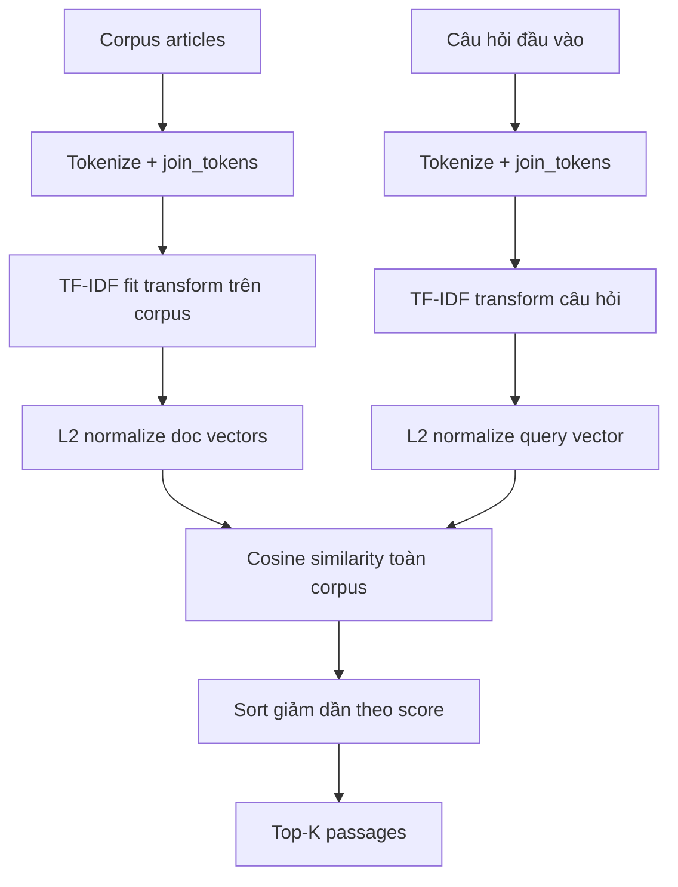
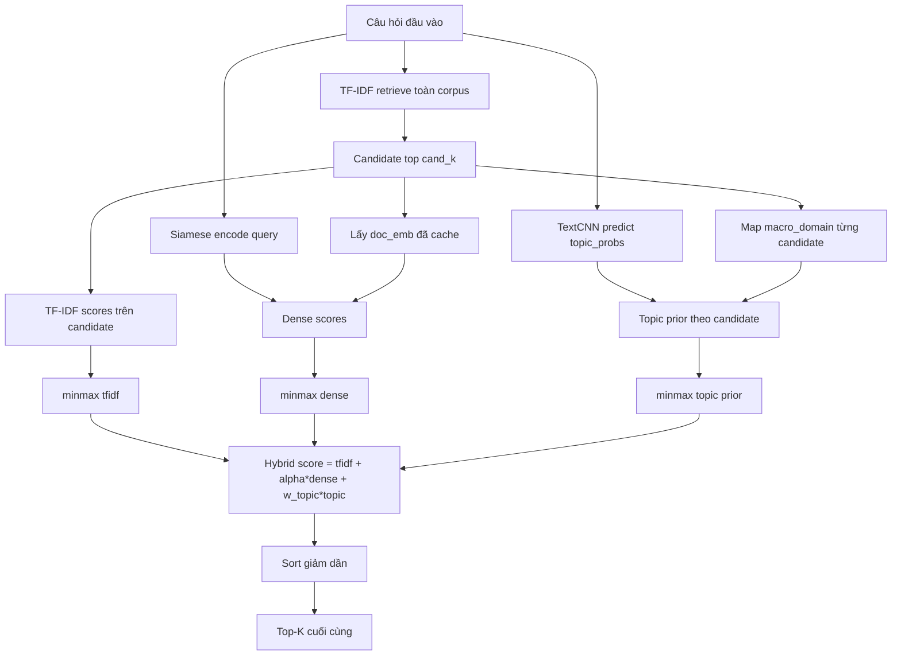

# So sánh Baseline và Mô hình cải tiến (Retrieval)

## 1) Mô tả baseline (chi tiết)

**Baseline** sử dụng `TF-IDF + cosine similarity` trên **toàn bộ corpus**, không có bước lọc chủ đề hay rerank bằng mô hình neural.

### 1.1. Mục tiêu

- Thiết lập một đường chuẩn lexical mạnh, dễ tái lập.
- Đo mức hiệu quả khi chỉ dựa vào trùng khớp từ/cụm từ (không dùng biểu diễn dense).

### 1.2. Luồng xử lý

1. **Tiền xử lý văn bản**
   - Câu hỏi và đoạn văn được tokenize bằng `tokenize_vi_fixed`.
   - Danh sách token được nối lại thành chuỗi bằng khoảng trắng (`join_tokens`) để đưa vào TF-IDF.

2. **Xây dựng biểu diễn corpus**
   - Dùng `TfidfVectorizer(max_features=80000, ngram_range=(1,2), min_df=2)`.
   - Fit trên toàn bộ `articles` để tạo ma trận `doc_tfidf`.
   - Chuẩn hóa L2 theo từng dòng: `doc_tfidf_norm`.

3. **Truy vấn**
   - Câu hỏi được transform qua cùng vectorizer, sau đó chuẩn hóa L2.
   - Tính điểm tương đồng cosine với toàn bộ corpus bằng phép nhân ma trận thưa.

4. **Xếp hạng**
   - Lấy top-K theo điểm cao nhất (`argpartition` + `argsort`).
   - Trả về chỉ số đoạn và điểm cosine tương ứng.

### 1.3. Sơ đồ baseline

### 1.4. Ưu điểm / hạn chế

- **Ưu điểm:** nhanh, đơn giản, ổn định; làm baseline tốt cho retrieval thuần văn bản.
- **Hạn chế:** khó bắt quan hệ ngữ nghĩa paraphrase; phụ thuộc mạnh vào trùng từ khóa; không tận dụng thông tin chủ đề.

## 2) Mô tả mô hình cải tiến (chi tiết)

**Mô hình cải tiến** là pipeline hybrid nhiều tầng, kết hợp tín hiệu lexical + semantic + topical.

### 2.1. Ý tưởng chính

- Giữ TF-IDF để đảm bảo recall ứng viên ban đầu.
- Dùng TextCNN để thêm prior theo `macro_domain` (thông tin chủ đề pháp lý).
- Dùng Siamese BiLSTM để đo độ gần ngữ nghĩa trong không gian dense.
- Trộn các tín hiệu sau khi chuẩn hóa về cùng thang điểm.

### 2.2. Luồng xử lý end-to-end

1. **Candidate generation (lexical)**
   - Chạy baseline TF-IDF trên toàn corpus.
   - Lấy `need = max(k, cand_k)` với `cand_k = 300` làm tập ứng viên ban đầu.

2. **Topic prior từ TextCNN**
   - Encode câu hỏi và suy ra `topic_probs` (xác suất trên các chủ đề).
   - Với mỗi đoạn ứng viên, ánh xạ `macro_domain -> domain_id`.
   - Lấy prior theo đoạn: `topic_prior_cand = topic_probs[passage_domain_ids[cand_idx]]`.

3. **Dense rerank từ Siamese BiLSTM**
   - Encode câu hỏi thành vector dense chuẩn hóa L2.
   - Lấy embedding đã cache của đoạn ứng viên (`doc_emb_all[cand_idx]`).
   - Tính `dense_scores` bằng dot product (tương đương cosine do đã L2-norm).

4. **Chuẩn hóa và fusion**
   - Chuẩn hóa min-max theo từng query cho 3 tín hiệu:
     - `tfidf_n = minmax(tfidf_scores)`
     - `dense_n = minmax(dense_scores)`
     - `topic_n = minmax(topic_prior_cand)`
   - Tính điểm cuối:
     - `hybrid = tfidf_n + alpha * dense_n + TOPIC_BLEND_WEIGHT * topic_n`

5. **Final ranking**
   - Sắp xếp giảm dần theo `hybrid`.
   - Trả top-K cuối cùng.

### 2.3. Sơ đồ pipeline cải tiến

### 2.4. Siêu tham số và tuning

- `TOPIC_BLEND_WEIGHT = 0.15`
- `RERANK_CAND_K = 300`
- `ALPHA_GRID = [0.0, 0.05, 0.1, 0.2, 0.3, 0.5]`
- Tune `alpha` trên validation theo `MRR`; kết quả tốt nhất: `alpha = 0.5`

### 2.5. Vì sao pipeline này hiệu quả hơn baseline

- TF-IDF giữ vai trò “recall anchor”, tránh bỏ sót quá sớm.
- Dense score xử lý tốt trường hợp câu hỏi và đoạn đúng không trùng nhiều từ bề mặt.
- Topic prior giúp ưu tiên đoạn có chủ đề phù hợp, đặc biệt hữu ích khi từ khóa mơ hồ giữa nhiều lĩnh vực luật.

## 3) Bảng kết quả so sánh (test set)

Thiết lập đánh giá:

- Số query test: `2991`
- Số đoạn corpus: `9715`
- K đánh giá: `@1, @5, @10`
- Các metric chính: `Recall`, `Precision`, `nDCG`, `MRR`, `MAP`, `MR_hit`, `MedR_hit`

| Metric                      | Baseline TF-IDF | Improved (Hybrid) | Chênh lệch (Improved - Baseline) |
| --------------------------- | --------------- | ----------------- | -------------------------------- |
| Recall@1                    | 0.5680          | 0.5811            | +0.0130                          |
| Recall@5                    | 0.8248          | 0.8322            | +0.0074                          |
| Recall@10                   | 0.8873          | 0.8913            | +0.0040                          |
| Precision@1                 | 0.5680          | 0.5811            | +0.0130                          |
| Precision@5                 | 0.1650          | 0.1664            | +0.0015                          |
| Precision@10                | 0.0887          | 0.0891            | +0.0004                          |
| nDCG@1                      | 0.5680          | 0.5811            | +0.0130                          |
| nDCG@5                      | 0.7075          | 0.7170            | +0.0095                          |
| nDCG@10                     | 0.7278          | 0.7361            | +0.0083                          |
| MRR                         | 0.6767          | 0.6863            | +0.0097                          |
| MAP                         | 0.6767          | 0.6863            | +0.0097                          |
| MR_hit (thấp hơn tốt hơn)   | 2.0083          | 1.9809            | -0.0274                          |
| MedR_hit (thấp hơn tốt hơn) | 1.0000          | 1.0000            | 0.0000                           |

## 4) Nhận xét nhanh

- Pipeline cải tiến cho **mức tăng nhất quán** trên hầu hết metric, đặc biệt ở `Recall@1`, `MRR`, `nDCG@5/10`.
- Mức cải thiện tuy không quá lớn nhưng ổn định, cho thấy `dense score + topic prior` bổ sung tốt cho tín hiệu lexical của TF-IDF.
- `MR_hit` giảm từ `2.0083` xuống `1.9809` nghĩa là đoạn đúng được đẩy lên thứ hạng cao hơn trung bình.
- `MedR_hit` giữ ở `1.0`, cho thấy trung vị truy hồi vẫn rất tốt.

## 5) Lưu ý tái lập

- Artifact TextCNN và Siamese được load từ Kaggle input.
- Để kết quả sát với lúc train, nên cài tokenizer backend tương ứng (`pyvi`), tránh fallback whitespace.

